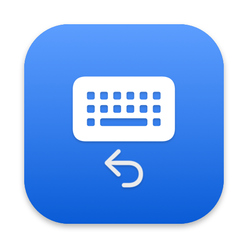

<p align="center">
  
</p>

<h1 align="center">豆包回切</h1>

<p align="center">豆包输入法语音说完后，自动切回你说话前用的输入法。</p>

<p align="center">
  <a href="https://github.com/Petterpx/DoubaoVoiceRestore/releases/latest"></a>
  
  <a href="LICENSE"></a>
</p>

---

## 问题

豆包输入法的「全局唤起语音」按下后会把系统输入法切成豆包，说完就停在豆包上，不会回到你原来用的输入法。

已有的 Hammerspoon 方案靠监听触发键、模拟豆包的语音快捷键、定时切回。豆包一改快捷键，或者用了它自己的全局唤起，脚本就失效（见 Paxxs/Doubao-ime-hammerspoon #11、#4、#1）。

## 做法

本工具**不模拟任何按键**，只观察两件事：

- 当前输入源是谁（Carbon TIS）
- 豆包进程有没有在占用麦克风（CoreAudio 进程属性）

豆包录音结束后，等一小段时间让文字上屏，再切回录音前的输入源。**不需要任何系统权限**，不申请麦克风，不读取输入内容。

## 安装

1. 到 [Releases](https://github.com/Petterpx/DoubaoVoiceRestore/releases/latest) 下载 dmg，打开后把应用拖到「应用程序」。
2. 首次打开会被 Gatekeeper 拦下（应用是本地签名，未经 Apple 公证）。右键点击应用选「打开」，或在终端执行：

   ```bash
   xattr -d com.apple.quarantine /Applications/DoubaoVoiceRestore.app
   ```

3. 菜单栏出现键盘图标即已运行。

要求 macOS 15 或更新。

## 使用

在豆包里照常按你的全局语音键说话（比如按住右 Option）。松开后约 0.6 秒，输入法自动回到说话前的那个。

菜单栏图标会随状态变化：

| 图标 | 状态 |
|---|---|
| 实心键盘 | 等待豆包语音 |
| 声波 | 豆包语音输入中 |
| 键盘带「…」 | 语音已结束，等待文字上屏 |
| 空心键盘 | 已暂停自动切回 |
| 感叹号 | 无法读取录音状态，或切回失败 |

菜单项：

| 菜单项 | 说明 |
|---|---|
| 立即切回 | 手动切回一次 |
| 暂停自动切回 | 临时想用豆包打字时勾上 |
| 切回前等待 | 0.4 / 0.6 / 1.0 秒。文字偶尔丢尾巴就调大 |
| 切回到 | 默认「上一个使用的输入法」；也可以固定选一个，说完永远切到它 |
| 开机启动 | 登录时自动运行 |
| 打开日志 | `~/Library/Logs/DoubaoVoiceRestore/runtime.log`，只记录输入源和录音状态变化，不含任何输入内容 |

## 原理

每 50 ms 轮询一次：

- Carbon TIS 读当前输入源 ID
- CoreAudio 读豆包进程的 `kAudioProcessPropertyIsRunningInput`（经 `kAudioHardwarePropertyProcessObjectList` 枚举）

豆包音频输入从占用变为释放、且此前连续占用 ≥ 0.2 秒，进入宽限期；宽限期到期时若仍在豆包上，切到目标输入源。

非豆包输入源要连续观察 0.5 秒才记为切回目标。豆包唤起语音时输入源会先瞬间跳到 ABC 再进豆包，不过滤的话说完会被切到 ABC 而不是你原来的输入法。

状态机在 `Sources/VoiceRestoreCore/RestoreStateMachine.swift`，纯 Swift、无系统依赖，`swift test` 可测。设计文档见 [docs/superpowers/specs](docs/superpowers/specs/)。

## 从源码构建

```bash
swift test                 # 状态机单元测试
./Scripts/build-app.sh     # 出 build/DoubaoVoiceRestore.app（ad-hoc 签名）
./Scripts/make-dmg.sh      # 出 build/DoubaoVoiceRestore-<版本>.dmg
./Scripts/make-icns.sh     # 重新生成应用图标 Resources/AppIcon.icns
```

需要 Xcode 命令行工具，Swift 5.10 或更新。

## 致谢

CoreAudio 录音状态检测思路来自 [ChaseMoneyChaseFame/doubao-wetype-bridge](https://github.com/ChaseMoneyChaseFame/doubao-wetype-bridge)（MIT）。

## License

[MIT](LICENSE)
